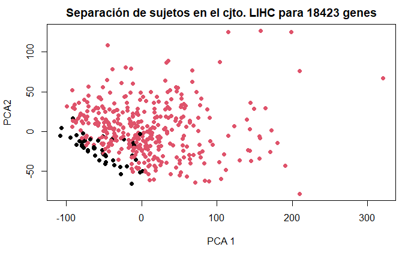
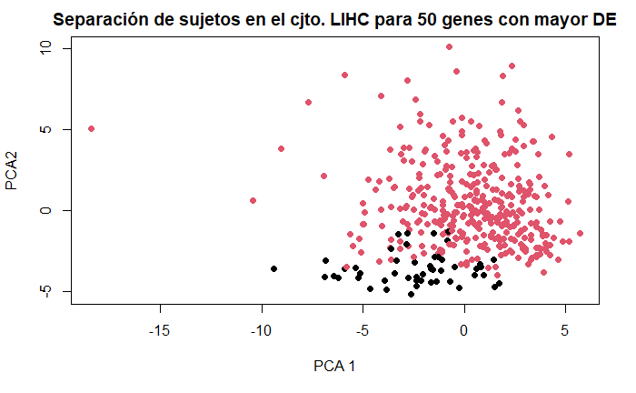
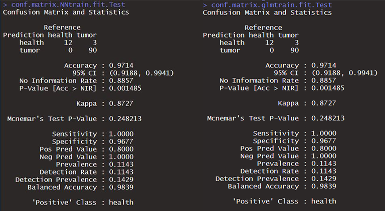

## Utilizando los datos de expresión que consideres como analizables de TCGA para HCC (LHIC) elabora un modelo GLM, RF, NN y uno de tu elección en R para predecir Cáncer/No-cáncer. Presenta el mejor modelo con un esquema de forma inteligible y atractiva. 

### 1. Librerias.

Las librerias que he necesitado para realizar esta pregunta en R han sido:
```r
library(TCGAbiolinks)
library(EDASeq)
library(caret)
```
### 2. Obtención de datos.
Desde el recurso TCGA web nos permiten descargar los datos de expresión RNAseq del estudio LIHC de muestras de células tumorales. Además, también podemos obtener los datos de expresión de genes en zonas del hígado con células sanas. Esto lo utilizaremos para crear la matriz con para predecir cancer/nocancer en base al perfil transcriptómico de cada muestra. 

Para ello, se ha creado una función que engloba todos los pasos que nos falicita TCGA para obtener los datos. Dicha función requiere de dos argumentos; el nombre del proyecto en la base de datos de TCGA(TCGA-LICH) y una lista con el barcode de todas las muestras. Esta última la he obtenido del [proyecto TCGA-LIHC](https://portal.gdc.cancer.gov/projects/TCGA-LIHC) en el portal GDC.
```r 
datos_TCGA_rnaseq<- function(_estudio_,_list.barcode.samples_){
    
  library(TCGAbiolinks)
    
        # Descargamos los datos de la base de datos TCGA
    query <- GDCquery(project = _estudio_, 
                  data.category = "Gene expression",
                  data.type = "Gene expression quantification",
                  experimental.strategy = "RNA-Seq",
                  platform = "Illumina HiSeq",
                  file.type = "results",
                  barcode = _list.barcode.samples_, 
                  legacy = TRUE)
  
    
        # Descarga los datos relacionados con el id de las muestras proporcionadas
    GDCdownload(query) 
    
        # Prepara una matriz de expresión con el geneID en las filas y las muestras (barcode) en las columnas
    Project_naseqSE <- GDCprepare(query) 
    
    Project_Matrix <- assay(Project_naseqSE,"raw_count",) 
    
    
       # Obtenemos los samples sanos y con tumor.
    samples_health <- TCGAquery_SampleTypes(barcode = colnames(_Project_Matrix_),
                                   typesample = c("NT"))
    samples_tumor <- TCGAquery_SampleTypes(barcode = colnames(_Project_Matrix_), 
                                   typesample = c("TP"))
    
    
        # Nos devuelve el nombre de los genes numerados (ex: ALP|1). Vamos a quedarnos solo con el nombre del gen (ALP)
    gene_id <- Project_naseqSE@rowRanges@elementMetadata@listData[["gene_id"]] 
    rownames(Project_Matrix) <-  gene_id
    
    
        # Devuelve un objeto S4 con, a su vez, varios objetos en su interior
    setClass(Class="Project",
         representation(
            Project_Matrix = "matrix",
            samples_tumor="character",
            samples_health="character"
          ))
    
    return(new("Project",
      Project_Matrix = Project_Matrix,
      samples_tumor=samples_tumor,
      samples_health=samples_health))

}
```


Llamamos a la función. Nos devuelve un objeto S4 donde se encuentra la matriz (Project_Matrix) con los datos de expresión de 19947 genes (filas) y 421 barcodes de muestras (columnas), los id de las muestras con cancer (samples_tumor) y los id de las muestras sanas (samples_health). Asignamos un nombre a cada objeto para mantenerlos por separado en nuestro _environment_.


```r
estudio = "TCGA-LIHC" 
samples = read.delim("C:/Users/lydia/Desktop/prueba/AI/sample.tsv", header=FALSE)
list.barcode.samples <- unique(samples[2:nrow(samples),"V3"])

datos_S4 <- datos_TCGA_rnaseq(estudio,list.barcode.samples)

LIHC_matrix <- datos_S4@Project_Matrix
samplesNT <- datos_S4@samples_health
samplesTP <- datos_S4@samples_tumor
```

### 3. Pre-procesamiento.
Dada la gran cantidad de genes vamos a realizar un amplio preprocesamiento para quedarnos con aquellas que nos proporcionen mayor información. En primer lugar, eliminamos los genes con una varianza cercana a cero. Añadimos la columna _diagnosis_ para separar a nuestras muestras con cancer (tumor) y las muestras sanas (health).
Tras ello, realizamos un PCA para ver como están distribuidos nuestros sujetos con cancer y sanos.


```r

nvz <- nearZeroVar(t(LIHC_matrix))
LIHCMatrix.filtered <- LIHC_matrix[-nvz,]

    # Vamos a ver como están distribuidos nuestros datos con un Analisis de componentes principales.

      # 1. Añadimos la columna _diagnosis_ para separar las muestras con cancer/sanas.

LIHCMatrix_diagnosis <- as.data.frame(LIHCMatrix.filtered)
LIHCMatrix_diagnosis$diagnosis = "tumor" #Creamos una nueva columna para la variable a clasificar.
LIHCMatrix_diagnosis[samplesNT,"diagnosis"] <- "health" # Asignamos el estado "sano" a aquellos que se encuentran en la variable samplesNT antes descrita.
LIHCMatrix_diagnosis$diagnosis <- as.factor(LIHCMatrix_diagnosis$diagnosis) # Cambiamos esta nueva columna a factor
table(LIHCMatrix_diagnosis$diagnosis)

      # 2. Realizamos el PCA y representados en base a la columna _diagnosis_.
    
pca = prcomp(LIHCMatrix_diagnosis[,1:ncol(LIHCMatrix.filtered) - 1],scale=T)
plot(x=pca$x[,1],y=pca$x[,2],pch=19,col=LIHCMatrix_diagnosis$diagnosis,
     xlab="PCA 1",ylab="PCA2",
     main="Separación de sujetos en el cjto. LIHC")
```
En la representación gráfica de nuestro PCA podemos observar como hay una agrupación de las muestras sanas en el tercer cuadrante mientras que las muestras cancerígenas se encuentran de forma dispersa abarcando diferentes cuadrantes.




#### 3.1. Selección de genes.

Dada la gran cantidad de genes vamos a seleccionar un determinado número de genes, aquellos que presentan mayor expresión diferencial (DE) entre las muestras sanas y las muestras con cáncer. Para ello, la plataforma TCGA proporciona una serie de comandos que se han encapsulado en una única función. Dicha función requiere de dos argumentos; la matriz con los datos de expresión de cada gen para cada muestra y el número de genes deseados con mayor DE, en este caso, se han seleccionado 50 genes. 


```r

preProcess_TCGA <- function(_Project_matrix_,_numero_){
  
     library(TCGAbiolinks)
        # Normalización
    dataNorm <- TCGAanalyze_Normalization(tabDF = _Project_matrix_, geneInfo =  geneInfo)

        # Filtrado de genes por cuartiles
    dataFilt <- TCGAanalyze_Filtering(tabDF = dataNorm,
                                      method = "quantile", 
                                    qnt.cut =  0.25)
    
        # Selección de muestras sanas
    samplesNT <- TCGAquery_SampleTypes(barcode = colnames(dataFilt),
                                       typesample = c("NT"))
    
        # Selección de muestras con cáncer
    samplesTP <- TCGAquery_SampleTypes(barcode = colnames(dataFilt), 
                                       typesample = c("TP"))
    
        # Diff.expr.analysis (DEA)
    dataDEGs <- TCGAanalyze_DEA(mat1 = dataFilt[,samplesNT],
                                mat2 = dataFilt[,samplesTP],
                                Cond1type = "Normal",
                                Cond2type = "Tumor",
                                fdr.cut = 0.01 ,
                                logFC.cut = 1,
                                method = "glmLRT")
    
        # Tabla con los valores de expresión en muestras sanas y muestras cancerígenas.
    dataDEGsFiltLevel <- TCGAanalyze_LevelTab(dataDEGs,"Tumor","Normal",
                                              dataFilt[,samplesTP],dataFilt[,samplesNT])
    
        # Escogemos los nombres de los X primeros genes con mayor expresión diferencial en valor absoluto. Lo utilizaremos como predictores para nuestro modelos de ML.
    genes_MaxDE <- as.factor(rownames(dataDEGsFiltLevel[sort(abs(dataDEGsFiltLevel$logFC),decreasing=T,index.return=T)[[2]],][1:_numero_,]))
    
    
    setClass(Class="Pre-process",
         representation(
            dataDEGsFiltLevel = "data.frame",
            genes_MaxDE= "factor"
          ))
    
    return(new("Pre-process",
          dataDEGsFiltLevel = dataDEGsFiltLevel,
          genes_MaxDE = genes_MaxDE
          ))
        
      }
```

Llamamos a la función que nos devuelve un objeto S4 que contiene una tabla donde aparecen los resultados del análisis de expresión diferencial(_DEA_) para cada gen y una lista con el geneid de los 50 primeros genes con mayor valor en el _DEA_. Tras ello, filtramos la matriz con estos 50 genes en las columnas y las muestras en las filas. Identificamos las muestras con cancer/sanas.

Realizamos un PCA para observar la distribución de las muestras con los valores de expresión de estos 50 genes.

```r

    # Llamada a la función
genes_DE <- preProcess_TCGA(LIHCMatrix.filtered,50)

    # Seleccionamos solo las columnas que pertenecen a los 50 genes. Añadimos la columna _diagnosis_ que nos va a permitir diferenciar las muestras con cáncer y sanas.
LIHCMatrix_diagnosis <- LIHCMatrix_diagnosis[,genes_DE@genes_MaxDE]
LIHCMatrix_diagnosis$diagnosis = "tumor" 
LIHCMatrix_diagnosis[samplesNT,"diagnosis"] <- "health" 
LIHCMatrix_diagnosis$diagnosis <- as.factor(LIHCMatrix_diagnosis$diagnosis) 

    # PCA post-eleccion de genes
pca_post = prcomp(LIHCMatrix_diagnosis[,1:ncol(LIHCMatrix_diagnosis) - 1],scale=T)
plot(x=pca_post$x[,1],y=pca_post$x[,2],pch=19,col=LIHCMatrix_diagnosis$diagnosis,
     xlab="PCA 1",ylab="PCA2", main="Separación de sujetos en el cjto. LIHC para 50 genes con mayor DE")


```

En el resultado del PCA podemos observar como las muestras sanas continúan agrupadas así como las muestras cancerígenas siguen dispersas entre los diferentes cuadrantes.




### 4. Modelos de Machine-Learning.

En primer lugar, particionamos los datos entre datos de test (75%) y datos de train (25%). Indicamos los 50 genes sobre los que se va a construir el modelo y la variable a predecir, en este caso, la columna diagnosis (tumor/health). En este caso, se ha utilizado el paquete _caret_ para realizar los modelos de ML. Definimos el control para todos los modelos con el método repeated cross-validation.

```r

    # Particion de datos
trainIndex <- caret::createDataPartition(LIHCMatrix_diagnosis$diagnosis,
                                         p=0.75,
                                         list = F)
data.train <-LIHCMatrix_diagnosis[trainIndex,]
data.test <-LIHCMatrix_diagnosis[-trainIndex,]


    # Variables 
variable_output = c("diagnosis")
variables_input = setdiff(names(LIHCMatrix_diagnosis),variable_output)

    # Control
ctrl <- trainControl(method = "repeatedcv",
                     number = 10,
                     repeats=2,
                     verboseIter = TRUE,
                     returnResamp = "all",
                     allowParallel = TRUE)

```

A continuación se muestran los comandos utilizados para realizar cada modelo.

#### 4.1. Generalized Linear Model (GLM) 

```r
LIHC.glmtrain.fit.rds<-train(data.train[variables_input],
                                data.train[[variable_output]],
                                method= "glm",
                                trControl = ctrl,
                                preProc = c("center", "scale"),
                                family = "binomial"))
                                
```

#### 4.1. Random Forest (RF) 

```r

seeds <- vector(mode = "list", length = 11)
for(i in 1:5) seeds[[i]]<- sample.int(n=1000, 11)
seeds[[11]]<-sample.int(1000, 1)

LIHC.rftrain.fit.rds<-train(data.train[variables_input],
                            data.train[[variable_output]],
                            method= "rf",
                            trControl = ctrl,
                            metric="Accuracy",
                            preProcess = c("center", "scale"),
                            seeds=seeds)

```

#### 4.1. K-Nearest Neighbors (K-NN) (modelo a mi elección)

```r
LIHC.knnrain.fit.rds<-train(data.train[variables_input],
                            data.train[[variable_output]],
                            method = "knn",
                            trControl=ctrl,
                            preProcess = c("center", "scale"))

```
#### 4.1. Neural Network (NN) 

```r

LIHC.NNtrain.fit.rds <- train(data.train[variables_input],
                              data.train[[variable_output]], 
                              method = "nnet",
                              preProcess = c("center", "scale"),
                              trControl = ctrl)

```
Tras entrenar los modelos de machine learning, vamos a utilizarlos para la predicción sobre los datos de test. Visualizamos los resultados con una matriz de confusión.

```r
datos_test = data.test$diagnosis

# Visualizamos la matriz de confusiónn del train
rf.predict.test <- predict(LIHC.rftrain.fit,data.test)
conf.matrix.rftrain.fit.Test <- confusionMatrix(rf.predict.test,datos_test)
conf.matrix.rftrain.fit.Test

glm.predict.test <- predict(LIHC.glmtrain.fit,data.test)
conf.matrix.glmtrain.fit.Test <- confusionMatrix(glm.predict.test,datos_test)
conf.matrix.glmtrain.fit.Test

NN.predict.test <- predict(LIHC.NNtrain.fit,data.test)
conf.matrix.NNtrain.fit.Test <- confusionMatrix(NN.predict.test,datos_test)
conf.matrix.NNtrain.fit.Test

knn.predict.test <- predict(LIHC.knntrain.fit,data.test)
conf.matrix.knntrain.fit.Test <- confusionMatrix(knn.predict.test,datos_test)
conf.matrix.knntrain.fit.Test

```

En este caso, son dos los modelos con mayor _accuracy_ (0.9714): Generalized Linear Model y Neural Network. Podemos ver los resultados en la imagen inferior. Ambos han predicho correctamente 19 muestras para _health_ y 90 para tumor. Al contrario, han clasificado erróneamente 3 muestras de tumor como muestras sanas (_health_). Lo que ha provocado que la especificidad baje al 0.9677.





Dado que nunca he creado un modelo de Machine Learning en Python y, dada su aparente complejidad, en esta valoración no voy a poder entregarlo ya que me gustaría realizarlo con tiempo y entendiendo el proceso en su totalidad. Sin embargo, investigaré una vez lo haya entregado para ampliar mis conocimientos.

