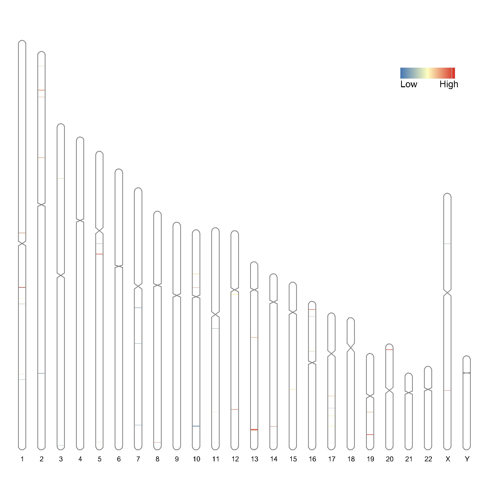

## Se ha encontrado este artículo en la web RIdeogram: drawing SVG graphics to visualize and map genome-wide data on the idiograms (adjunto al mail), aplíquelo a los datos de TCGA.

### 1. Librerias.
```markdown
library("clusterProfiler")
library("org.Hs.eg.db")
library("biomaRt")
library("RIdeogram")

```

### 2. Manipulación de datos.

Los datos que se van a utilizar en este apartado serán los 50 genes seleccionados de los datos de TCGA anteriores. Dado que tenemos el _symbol_ de cada gen, en primer lugar, vamos a hayar su ensembl ID asociado. Tras ello, con el paquete _biomaRt_ vamos a determinaren que cromosoma y en que lugar comienza y termina cada gen.

```markdown
list_geneid <- readRDS(file = "list_geneid.rds")
ensembl_id <- clusterProfiler::bitr(list_geneid,fromType ="SYMBOL", toType = c("ENSEMBL"), OrgDb="org.Hs.eg.db")[1:50,2]
ensembl <- useEnsembl(biomart = "genes", dataset = "hsapiens_gene_ensembl")
genes_position <- getBM(attributes = c("chromosome_name","start_position","end_position"),
              filters = "ensembl_gene_id",
              values = ensembl_id, 
              mart = ensembl)
```

Obtenemos un data frame con nuestros datos que serán utilizado en el paquete RIdeogram. Ajustamos el nombre de las columnas. Añadimos una columna más a nuestro data frame dando un valor a cada gen, de 50 a 1 en orden decreciente. 

```markdown
colnames(genes_position) <- c("Chr","Start","End")
genes_position <- cbind(genes_position, "Value" = 50:1)
```

### 3. Aplicación del paquete.

Añadimos a nuestro _environment_ el cariotipo humano. Llamamos a la función _ideogram_ para dibujar nuestro cariotipo humano con los 50 genes seleccionados. Por último, convertimos nuestro archivo _.svg_ en formato _.png_. El resultado se observa a continuación.

```markdown
data(human_karyotype, package="RIdeogram")
ideogram(karyotype = human_karyotype, overlaid = genes_position, label = NULL, output = "chromosome.svg")
convertSVG("chromosome.svg", device = "png")
```


