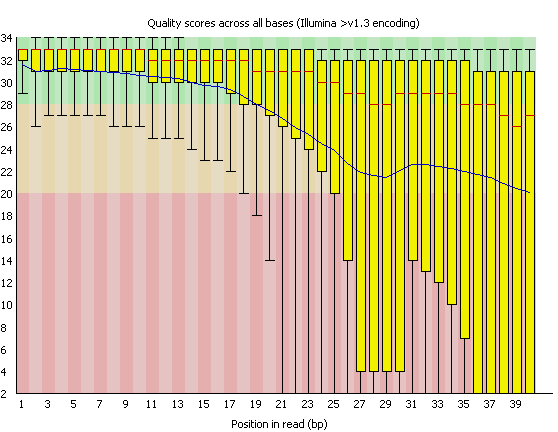

# Apartado A

## Hemos descubierto un tRNA quimérico por PCR convencional. Este tRNA se expresa solo en células extraídas de una muestra de cáncer de colon, al contrario que en las células control. Elabora un esquema de un pipeline capaz de detectar este evento en un RNA-seq convencional (Paired-end) partiendo de archivos fastq. Especifique los programas que utilizará y los comandos en estos (eres libre de usar cualquier programa publicado o inventado por ti, explícalo de forma que quede claro para un no bioinformático y resulte atractivo):

### 1. Quality Control (FastQC y Cut Adapt).


Comenzamos el pipeline con la evaluación de la calidad de los datos obtenidos a través de la secuenciación. Para ello, primero se hace uso de ciertas herramientas que permiten observar la calidad de los fragmentos secuenciados, asi como la posible modificación de los mismos, con el objetivo de preservar únicamente aquella información con la suficiente calidad / veracidad.


### 1.1 Quality assessment.


FastQC es una herramienta que permite generar gran cantidad de gráficos que ilustran la calidad de las lecturas obtenidas, lo que en definitiva transmite información acerca de la veracidad de las mismas. Entre estas gráficas, encontramos: calidad de lectura de los fragmentos por cada base secuenciada, distribución de la calidad media de los fragmentos, contenido GC, número de no lecturas (N), distribución de la longitud de las lecturas, número de lecturas duplicadas o sobrerrepresentadas (i.e adaptadores) entre otras.

En este caso se ha utilizado FastQC, un programa con una GUI o interfaz bastante amigable, que permite realizar dichos tests de forma bastante sencilla.

Ejemplo:




### 1.2 Filtering y Trimming.


En caso de que se observaran anomalías o problemas de calidad en las lecturas, se puede recurrir a herramientas como CutAdapt o FastQ Trimmer, que posibilitan modificarlas, excluyendo aquellas regiones o lecturas que no interesan. Estas técnicas pueden incluir el descarte de todas aquellas lecturas por debajo de un umbral de calidad determinado, la eliminación de secuencias como los adaptadores(secuencias sobrerrepresentadas que no interesan), o la acortación de estas para retener únicamente las secciones por encima de dicho límite de calidad.

Estas herramientas se podrían ejecutar a través de servidores Galaxy, que permiten hacerlo de forma sencilla a través de, nuevamente, una interfaz gráfica. No obstante, ejecutarlas de forma manual a través de comandos permite obtener un poder de configuración de la herramienta significativamente mayor.

Configuramos CutAdapt para:

- Eliminar los adaptadores.
- Eliminar toda aquella secuencia por debajo de una determinada longitud.
- Eliminar todo aquel extremo 3' de las secuencias con una calidad deficiente(dado que es el extremo que suele presentar una peor calidad en Illumina).
- Eliminar toda aquella lectura en la que no se ha encontrado adaptadores.

Para ello, lanzamos cutadapt con los siguientes parámetros:

```bash
cutadapt -a ADAPTER_FWD -A ADAPTER_REV -o out.1.fastq -p out.2.fastq reads.1.fastq reads.2.fastq -m 250 -M 250 -q 28 --discard-untrimmed
```

### 2. Alineamiento.

El siguiente paso consiste en el alineamiento de los fragmentos secuenciados con el genoma de referencia. Para ello, no se puede utilizar un alineador tradicional, dado que los intrones harían muy difícil el proceso al introducir sesgos en el genoma. Hay una serie de programas especializados en RNA seq, como TopHat2, que parte del alineador Bowtie para posteriormente considerar los intrones en el proceso. 

### 2.1 Indexar genoma de referencia.

Es un proceso necesario para que Bowtie acceda de forma rápida al genoma de referencia. Para realizarlo, introducimos el siguiente comando:

```bash
bowtie2-build -f Homo_sapiens.GRCh38.fa ihg38
```

Ello produce como salida archivos con extensión .bt2, que contienen las secuencias de referencia contra las que seran alineadas nuestros fragmentos. 

### 2.2 Alineamiento.

Usamos el software TopHat2, que incluye una herramienta para la búsqueda de transcritos quiméricos ("--fusion-search"). Especificamos el genoma de referencia anotado (.gtf), el directorio donde TopHat2 guardará los resultados ("./aligment_output") y las lecturas de ambos sentidos (R1.fastq y R2.fastq).

```bash
tophat -G ./hg38.gtf -o ./aligment_output ./ihg38 ./Sample1.R1.fastq ./Sample1.R2.fastq --fusion-search
```
De entre todos los archivos generados, podemos echar un vistazo al archivo fusion.out para encontrar los posibles transcritos quiméricos.

### 3. Filtrado de transcritos.

Si se desea, posteriormente, se puede usar TopHat-fusion-post para filtrar transcritos quiméricos(del total de candidatos generados en el paso anterior). Es aconsejable repetir este proceso con distintos parámetros de filtrado. Lanzamos este comando en el directorio de salida de TopHat2:

```bash
tophat-fusion-post --num-fusion-reads 1 --num-fusion-pairs 2 --num-fusion-both 5 ../ihg38
```

Los transcritos quiméricos finales podrán ser encontrados en los archivos result.txt o result.html.
