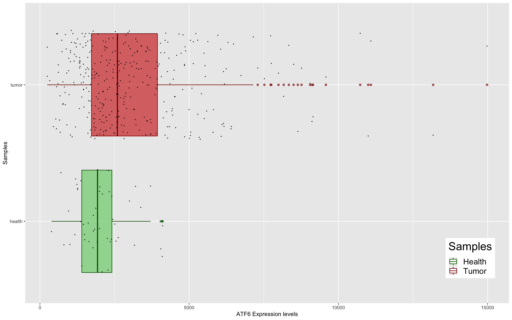

# Apartado B

## Hemos iniciado el estudio del hepatocarcinoma recientemente, necesitamos saber la expresión de XBP1, ATF6 y CD36 en TCGA en el gráfico que consideres más explicativo. También hemos visto que se han publicado estos dos experimentos: GSE11536 y GSE154964 el primero más relacionado con HCV, también nos gustaría saber la expresión de estos genes en estos dos estudios. Explica los problemas que te han surgido y como los has resuelto.


### 1. Genes XBP1, ATF6 y CD36 de TCGA.

La expresión de los genes XBP1, ATF6 y CD36 de TCGA vamos a representarla por separado mediante un diagrama de cajas (boxplot). Para ello, utilizaremos la matriz que obtuvimos con los datos de expresión de todos los genes en el ejercicio de AI. Filtramos para cada boxplot por nuestro gen de interés para muestras con cáncer y sanas.

```r

boxplot(LIHCMatrix_diagnosis[samplesNT,"XBP1"],
        LIHCMatrix_diagnosis[samplesTP,"XBP1"],
        col = c(colors()[514],colors()[373]),
        names = c("Health", "Tumor"),
        border = c(colors()[113],colors()[36]),
        horizontal = T,
        main = "XBP1 expression",
        ylab = "Diagnóstico del paciente",
        xlab= "Nivel de expression")

boxplot(LIHC_matrix_genes[samplesNT,"ATF6"],
        LIHC_matrix_genes[samplesTP,"ATF6"],
        col = c(colors()[514],colors()[373]),
        names = c("Health", "Tumor"),
        border = c(colors()[113],colors()[36]),
        horizontal = T,
        main = "XBP1 expression",
        ylab = "Diagnóstico del paciente",
        xlab= "Nivel de expression")

boxplot(LIHC_matrix_genes[samplesNT,"CD36"],
        LIHC_matrix_genes[samplesTP,"CD36"],
        col = c(colors()[514],colors()[373]),
        names = c("Health", "Tumor"),
        border = c(colors()[113],colors()[36]),
        horizontal = T,
        main = "XBP1 expression",
        ylab = "Diagnóstico del paciente",
        xlab= "Nivel de expression")

```

El resultado se puede ver en las siguientes imágenes:





### 2. Experimentos GSE11536 y GSE154964.

En cuanto a la expresión de estos mismos genes en los experimentos GSE11536 y GSE154964, no he podido encontrar la información relativa a la expresión de dichos genes individualmente. Por lo que ha sido imposible realizar este apartado del ejercicio.

