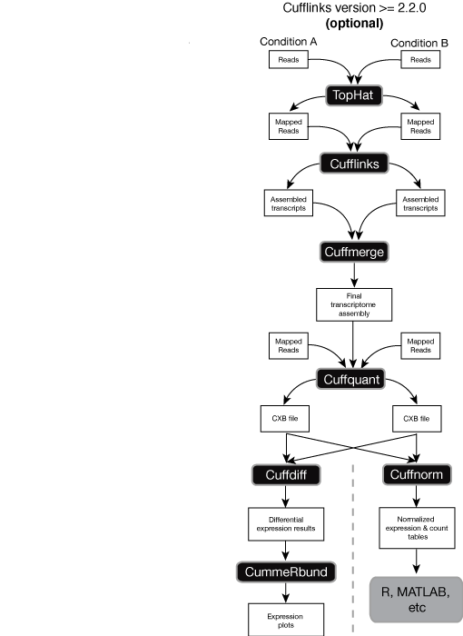

# Apartado C

## Explique paso a paso el análisis de expresión diferencial de un RNAseq a partir de fastqs mencionando los programas que utilizara (los comando puede añadirlos si así lo desea) y comentando en que consta cada paso hasta obtener genes diferencialmente expresados.

Existen diversas estrategias para la ejecución de un análisis de expresión diferencial. En este caso, se usará el protocolo Tuxedo, ampliamente utilizado en los últimos años. Este consta de 3 grandes pasos *:

- Ensamblado del transcriptoma.
- Cuantificación de la expresión de cada gen.
- Comparativa de la expresión.
 
*Precedidos por el análisis de calidad de las lecturas obtenidas, explicado en el apartado A.

### 1. Ensamblado del transcriptoma: Cufflinks

El primer paso consiste en el alineamiento de los fragmentos con el genoma de referencia, lo que permitirá obtener el número y la procedencia de los transcritos secuenciados. Para ello hacemos uso de nuevo de TopHat2. Tras ello, ejecutamos Cufflinks, que trata de construir transcritos a partir de las lecturas.

### 2. Cuantificación de la expresión: Cuffdiff

Cuffdiff trata de cuantificar la expresión de los genes/transcritos detectados, en función del número de fragmentos que alinean con los mismos. El resultado da lugar a archivos _CBX_ en donde encontramos los transcritos detectados y su expresión no normalizada.

### 3. Comparativa de la expresión 

Una vez mas, existen diversas posibles estrategias a seguir. En el método Tuxedo tradicional se utiliza Cuffdiff y CummeRbund para resaltar aquellos genes expresados de forma sustancialmente diferencial respecto al resto. 

Por otro lado, existen alternativas que han ganado gran relevancia en los últimos años. Esta consiste en la normalización de los datos de expresión proporcionados por cuffquant, y su posterior análisis a través de otras plataformas (por ejemplo, r) y protocolos.

Una vez obtenidos los genes mas relevantes, con una expresión destacable, conviene realizar un análisis funcional(análisis de enriquecimiento) para detectar las funciones en las que están implicados y, poder así contextualizar mejor las diferencias observadas.

1 Protocolo Tuxedo.
